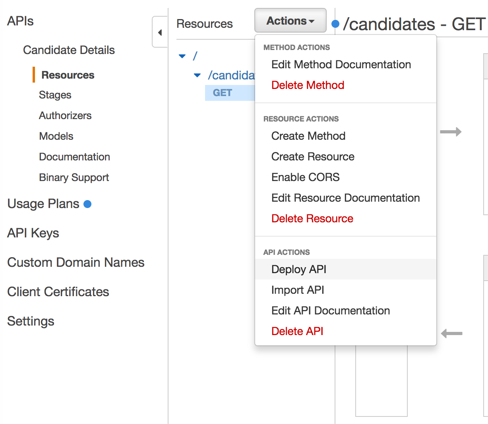
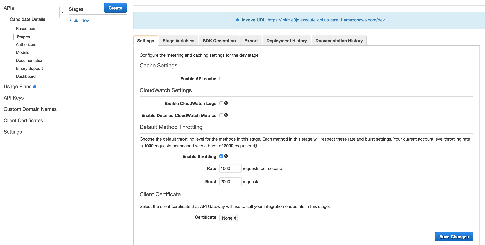

# Building a REST API in Node.js with Lambda and API Gateway using web console

Welcome to second part of this series. Today, we will build a REST API that will store candidate details into the DynamoDB. We will start by building REST API using the AWS web console. Once we get the feel of how it is to work with web console we will use Serverless framework to build the REST API.

## Prerequisite

To go through this tutorial you will need following:

1. AWS account
2. Node.js
3. AWS CLI and configure it.

## Building REST API using web console

It is easy to expose a REST API using AWS service. It is a two step process:

1. Create an Amazon API Gateway that exposes resources and methods.
2. Integrate API Gateway with Amazon Lambda

### Step 1: Login to AWS web console

Login to AWS web console https://console.aws.amazon.com/console/home and select [API Gateway service](https://console.aws.amazon.com/apigateway/home). If you don't have any API Gateway service, then you will greeted with a greeting message. Click on ***Get Started*** button.

### Step 2: Create new API 

Once you are inside the API Gateway editor, select ***New API*** from the option to create the API. Amazon API Gateway supports multiple ways to create the API.  If you have Swagger API definition files you can use them to create your service as well. The other way to create an API is to create an example API and the modify it to meet your use case. We will use New API way as it allows us to configure all the options ourselves.

To create an API, you have to specify API name. We have specified ***Candidate Details*** as the API name. You can optionally specify description. Once you have entered all the details you can press the ***Create API*** button.

### Step 3: Create `candidates` resource

After pressing ***Create API*** button, you will be inside the API Gateway editor that gives you all the capabilities to create an API. Click on Create Resource as shown below.

After selecting ***Create Resource***, you will be shown a form to provide details about the resource. Enter the information as shown below. Click on ***Create Resource*** button after providing details.

 

After you press ***Create Resource*** button, you will find `candidates` resource inside the root resource as shown below.

### Step 4: Create `GET` method 

Resource defines the entity of your application. Now, you need to declare method that you want to expose for this resource. We will create a `GET` method that will render all the candidates information. Click on Create Method as shown below.

Next, select the GET method as shown below and press the tick mark button.

### Step 5: Setup integration point for the `GET` method

Next, you will setup which service will back your `GET` method. Your API gateway can be backed by a lambda function, an existing HTTP backend, a mock response, any other AWS service like S3. We will use Amazon Lambda backend.

As you don't have any lambda function yet so you will be asked to create a lambda function first before pursuing forward. Click on ***Create a Lambda Function*** link. It will open the web page in a new tab so don't worry about loosing details.

### Step 6: Create a blank Node.js Lambda function

We will select the Blank Function blueprint.Next, we will configure the function as shown below. We will leave it as it is.

Next, we will configure function

Change the code inline to the one shown below.

Next, we will configure the handler and role.

We will keep all other details same. Save the function.

### Step 7: Update API Gateway to use Lambda function

Now, that we have created our function we can configure API Gateway to use our newly created lambda function. 

Press the ***Save*** button after entering the details.  

You will be asked to give permissions to API Gateway to execute lambda function.

### Step 8: Test the API gateway

Next, we will test API gateway by pressing the Test link. Click on the ***Test*** and you will be shown the response of the function as shown below.

### Step 9: Deploy the API

So far API is not exposed to outside world. To expose the API, you have to click on the Deploy API.

After you press the Deploy API button, you will be asked to create a stage. This helps to take your API through different stages like dev, testing, prod. We will create a new stage dev and save it. This will then give you a URL that you can use. Your API will be accessible at URL like [https://ibkizie3jc.execute-api.us-east-1.amazonaws.com/dev](https://ibkizie3jc.execute-api.us-east-1.amazonaws.com/dev).

## Conclusion

In this part, we built a REST service using the AWS web console. In the [next part](./03-building-rest-api-in-nodejs-with-lambda-gateway-dynamodb-serverless.md), we will move away from the web console and start building our application using Serverless framework.