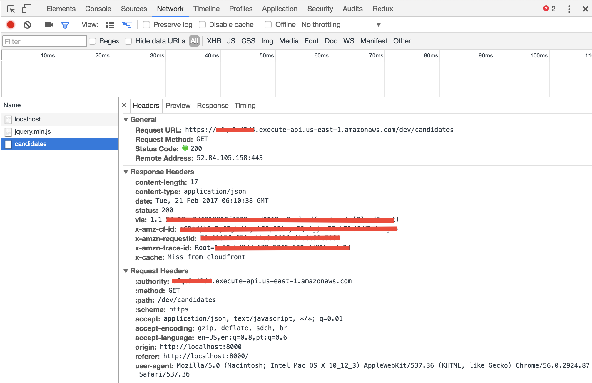
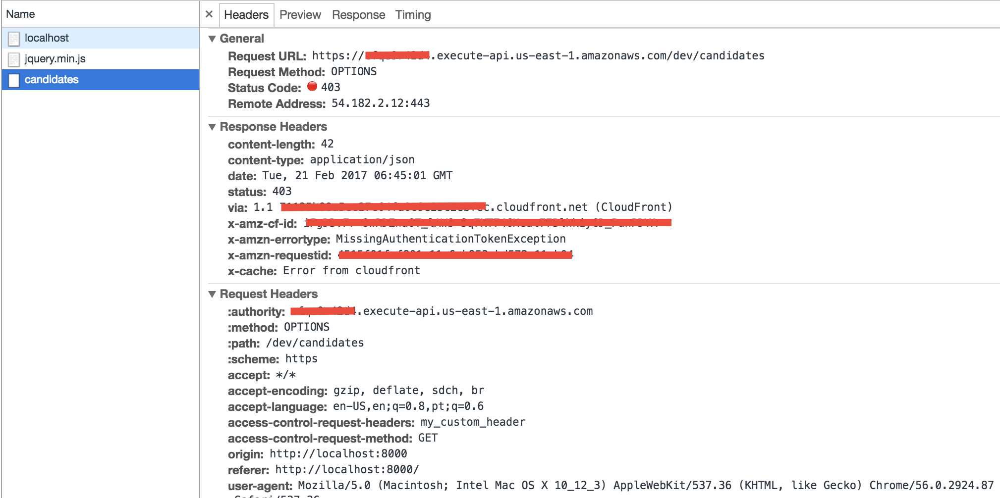
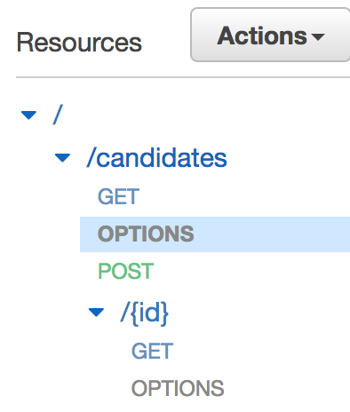

# Enabling CORS for your AWS API Gateway REST APIs

[CORS](https://www.w3.org/TR/cors/) stands for Cross-Origin Resource Sharing. It is a JavaScript standard that describes how a client-side web application hosted on one domain can make request to servers hosted on different domain. To enable CORS, you have to enable it to both client and server side components of your application. Client and server perform a CORS dance to successfully complete a request.  CORS lets server decide who can make what requests to them.

Browser security sandbox retricts you to request resource from a domain different from the one you are on. For example, if your web application is running locally on http://localhost:8000 and you make a call from your web browser to API Gateway https://05ccffiraa.execute-api.us-east-1.amazonaws.com/dev/candidates then your request will fail as browser will restrict cross-origin HTTP requests. Browsers enfore same origin policy that permits scripts in first web page to access data in second web page, but only if both web pages have the same origin. In our use case, we had different origins — http://localhost:8000 and http://05ccffiraa.execute-api.us-east-1.amazonaws.com so requests will not go succeed. CORS standard is a solution to this problem.

In this post, you will learn how you can enable CORS for our REST API so that we can access API from our web UI. This will be required on day 6 when we will build UI for our web application. Let's see it in action. Please make sure your API created on day 3 is available as we well be using that in today's article.

## Cross domain requests in action

Create a new HTML page that makes a GET call to the API Gateway. We will use jQuery to ease the process of making API calls.

```html
<html>
<head>
</head>
<body>
    <script src="https://cdnjs.cloudflare.com/ajax/libs/jquery/3.1.1/jquery.min.js"></script>
    <script>
        var apiUrl = "https://xxx.execute-api.us-east-1.amazonaws.com/dev/candidates";
        $.ajax({
            url: apiUrl,
            type: 'GET',
            dataType: 'json',
            success: function (data) { console.log(JSON.stringify(data, null, 2)); },
            error: function (error, textStatus, errorThrown) { console.error(textStatus) }
        })
    </script>
</body>

</html>
```

Please make sure you update `apiUrl` with correct URL of your API Gateway URL.

You can install the node `http-server` to start a local http server.

```
$ npm install http-server -g
```

Change directory to the location where you created the html. Then, you can start the server as shown below.

```
$ http-server -p 8000
```

This will start the server locally on port 8000. You can access the web page at http://localhost:8000.

When you will access the page, you will notice two errors inside your browser developer console. The first error will point to the issue that response does not contain header `Access-Control-Allow-Origin`.

```
XMLHttpRequest cannot load https://xxx.execute-api.us-east-1.amazonaws.com/dev/candidates. No 'Access-Control-Allow-Origin' header is present on the requested resource. Origin 'http://localhost:8000' is therefore not allowed access.
```

The second error will be the `console.error` that we added in the error handler.

This is what happended when you launched your web page:

1. On page load, a GET request was made by your browser to API Gateway. Browser understands that this requests is a cross-site request so adds `origin` header to the request. You can't override `origin`  header via code.
2. API Gateway returned the response with HTTP status code 200. 
3. Browser knew that this was a cross-origin request so expected `Access-Control-Allow-Origin` header in the response. As response didn't had `Access-Control-Allow-Origin` header so browser rejected the response. Hence, you saw the error message.

This is evident from the network call made to the `/candidates` endpoint as shown below.



`Access-Control-Allow-Origin` header must be present in the CORS request response. This header is set by the server to specify which all domains can access the resource in cross-site manner. 

## Two types of cross origin requests

There are two types of cross origin requests you can make:

1.  The first kind of requests are called simple requests. These are requests that uses either HEAD, POST, or GET HTTP methods. Also, they can only pass `Accept`, `Accept-Language`, `Content-Language`, `Last-Event-Id`, and `Content-Type` headers. `Content-Type` header can only have `application/x-www-form-urlencoded`, `multipart/form-data`, or `text/plain`. The request that we made above is a simple request as it met these criterias.

2.  The second kind of requests are called preflight requests. This request first makes an OPTIONS method call to the requested resource on the other domain. This is done to ask permission from the server if actual CORS request can be made. These requests are made anytime your request does not meet the criteria of simple requests. To see preflighted request in action, let's add a new header to our request.

    ```html
     <html>

     <head>
     </head>

     <body>
         <script src="https://cdnjs.cloudflare.com/ajax/libs/jquery/3.1.1/jquery.min.js"></script>
         <script>
             var apiUrl = "https://cfqe9r42d4.execute-api.us-east-1.amazonaws.com/dev/candidates";
             $.ajax({
                 url: apiUrl,
                 type: 'GET',
                 dataType: 'json',
                 headers: { 'MY_CUSTOM_HEADER': 'MY_CUSTOM_HEADER_VALUE' },
                 success: function (data) { console.log(JSON.stringify(data, null, 2)); },
                 error: function (error, textStatus, errorThrown) { console.error(textStatus) }
             })
         </script>
     </body>

     </html>
    ```

     In the HTML snippet shown above, we added `MY_CUSTOM_HEADER` header to the request. If you refresh the web page http://localhost:8000 you will notice that an OPTIONS request was made. As our API does not expose OPTIONS method so request failed.

     

     In the image shown above, there are few interesting things to notice:

    1. Browser made an OPTIONS method call.
    2. In the request, we passed our custom header in the `access-control-request-headers` header. This header notifies the server that when the actual request is sent, it will have `my_custom_header`. Server has to give permission that we can pass `my_custom_header` header in the request. We will configure API Gateway in the next section so that it accepts a custom header. If you don't configure API Gateway then request will be rejected.
    3. The `access-control-request-method` header notifies the server that actual request will be sent with GET method.

    Now, that we understand basics of CORS let's understand how we can configure API Gateway to allow CORS requests.

## Enable CORS in serverless.yml

Serverless framework makes it very easy to enable CORS for your API gateway methods. Open serverless.yml and add `cors: true` option as shown below.

```Yaml
functions:
  candidateSubmission:
    handler: api/candidates.submit
    memorySize: 128
    description: Submit candidate information and starts interview process.
    events:
      - http: 
          path: candidates
          method: post
          cors: true
  listCandidates:
    handler: api/candidates.list
    memorySize: 128
    description: List all candidates
    events:
      - http: 
          path: candidates
          method: get  
          cors: true
  candidateDetails:
    handler: api/candidates.get
    events:
      - http:
          path: candidates/{id}
          method: get
          cors: true
```

Now, deploy the functions again using `sls deploy -v`.

Once deployed, you will notice that OPTIONS methods are created for your API methods.



When you will refresh your web page http://localhost:8000 you will still see exception but this time exception will be different. 

```
XMLHttpRequest cannot load https://xxx.execute-api.us-east-1.amazonaws.com/dev/candidates. Request header field MY_CUSTOM_HEADER is not allowed by Access-Control-Allow-Headers in preflight response.
```

The reason for this exception is that OPTIONS method response header `access-control-allow-headers` does not contain `MY_CUSTOM_HEADER` in it. The response of OPTIONS method has following value for `access-control-allow-headers`

```
access-control-allow-headers:Content-Type,X-Amz-Date,Authorization,X-Api-Key,X-Amz-Security-Token
```

Serverless framework allows you to configure CORS in detail. The cors: true is a shortcut for following configuration.

```yaml
cors:
    origins:
        - '*'
    headers:
        - Content-Type
        - X-Amz-Date
        - Authorization
        - X-Api-Key
        - X-Amz-Security-Token
    allowCredentials: false  
```

Let's update the configuration in serverless.yml to the one shown below.

```yaml
functions:
  candidateSubmission:
    handler: api/candidates.submit
    memorySize: 128
    description: Submit candidate information and starts interview process.
    events:
      - http: 
          path: candidates
          method: post
          cors:
            origins:
              - 'http://localhost:8000'
            headers:
              - MY_CUSTOM_HEADER
              - Content-Type
              - X-Amz-Date
              - Authorization
              - X-Api-Key
              - X-Amz-Security-Token
    allowCredentials: false  
  listCandidates:
    handler: api/candidates.list
    memorySize: 128
    description: List all candidates
    events:
      - http: 
          path: candidates
          method: get  
          cors:
            origins:
              - 'http://localhost:8000'
            headers:
              - MY_CUSTOM_HEADER
              - Content-Type
              - X-Amz-Date
              - Authorization
              - X-Api-Key
              - X-Amz-Security-Token
  candidateDetails:
    handler: api/candidates.get
    events:
      - http:
          path: candidates/{id}
          method: get
          cors:
            origins:
              - 'http://localhost:8000'
            headers:
              - MY_CUSTOM_HEADER
              - Content-Type
              - X-Amz-Date
              - Authorization
              - X-Api-Key
              - X-Amz-Security-Token
```

When you load the web page again, this time you will see errors but both OPTIONS and GET call will be successfull. The error message that you will receive will be similar to the one that you received first time. 

```
XMLHttpRequest cannot load https://xxx.execute-api.us-east-1.amazonaws.com/dev/candidates. No 'Access-Control-Allow-Origin' header is present on the requested resource. Origin 'http://localhost:8000' is therefore not allowed access.
```

We still are missing `Access-Control-Allow-Origin` header in the response. You can check the network window to verify that. You will also notice that our custom header `my_custom_header` was passed to the request.


## Setting `Access-Control-Allow-Origin` header in the response

As you know, our API Gateway methods are backed by lambda functions. There are two ways API Gateway can be configured with lambda functions — 1) lambda-proxy 2) lambda. By default, Serverless  uses lambda-proxy as the backend for API Gateway. From the Serverless documentation,

> **The difference between these is `lambda-proxy` automatically passes the content of the HTTP request into your AWS Lambda function (headers, body, etc.) and allows you to configure your response (headers, status code, body) in the code of your AWS Lambda Function. Whereas, the `lambda` method makes you explicitly define headers, status codes, and more in the configuration of each API Gateway Endpoint (not in code). We highly recommend using the `lambda-proxy` method if it supports your use-case, since the `lambda` method is highly tedious.**

This means we have to set the `Access-Control-Allow-Origin` in the response ourselves. Open the `candidates/api.js` and change the list function to as shown below.

```javascript
module.exports.list = (event, context, callback) => {
  var params = {
    TableName: process.env.CANDIDATE_TABLE,
    ProjectionExpression: "id, fullname, email"
  };

  console.log("Scanning Candidate table.");
  const onScan = (err, data) => {

    if (err) {
      console.log('Scan failed to load data. Error JSON:', JSON.stringify(err, null, 2));
      callback(err);
    } else {
      console.log("Scan succeeded.");
      return callback(null, {
        statusCode: 200,
        headers: {
          "Access-Control-Allow-Origin": "http://localhost:8000"
        },
        body: JSON.stringify({
          candidates: data.Items
        })
      });
    }

  };
  dynamoDb.scan(params, onScan);
};
```

***Please make sure to add `headers` section to submit and get functions as well.***

Now, deploy your functions again `sls deploy`. Once deployed, you can refresh the web page and this time you will not see any error in the console. It will print all the candidate details.

```Json
{
  "candidates": [
    {
      "email": "shekhargulati84@gmail.com",
      "id": "87d0b6f0-f80b-11e6-b3c2-1bd3bc0bc03b",
      "fullname": "Shekhar Gulati"
    }
  ]
}
```

Now,  you have fully configured CORS for your API. 

## Conclusion

Today, we looked at how we can configure CORS for our REST API created using Serverless framework. You also learnt how Serverless allows you to configure services beyond the basics. In the [next part](./05-securing-rest-api-with-api-keys.md), we will secure REST API using API keys.