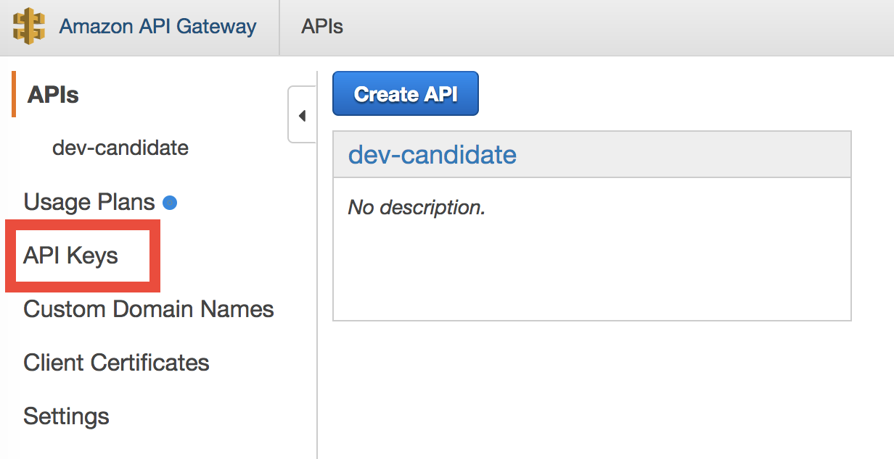
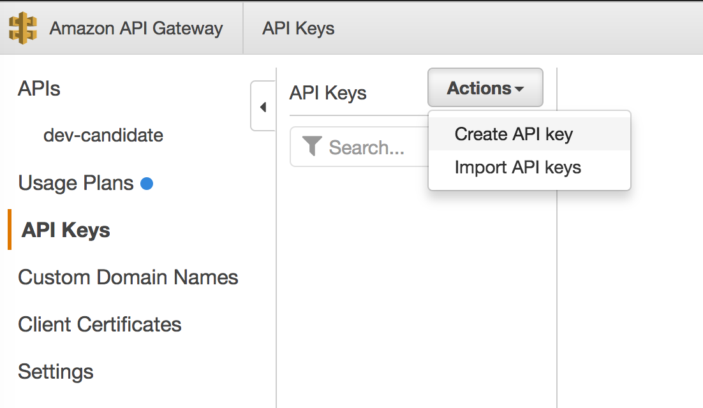
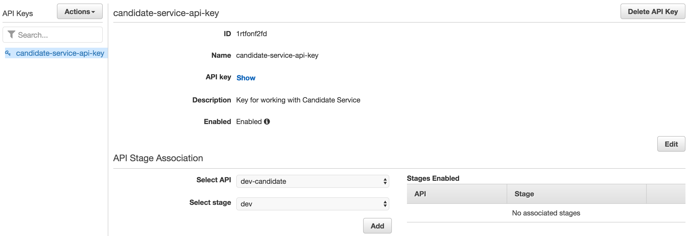

# Securing REST API with API Keys

The key premise of Serverless is that it reduces the operational burden of the development team. You can rely on the expertise of the cloud provider so that you focus on writing business code. One question that comes up when ever you talk about cloud computing is related to security. Is my application secure? There is no easy answer to this question. Security is a multi-facet topic and there are various aspects to security. Different layers of your application have different security requirements. Because Serverless application tend to be compose of small lightweight services you have to think about how different services can access resources, what they can and cannot see and declare that using IAM security roles. Today, we will look at securing REST API using Amazon API Gateway keys.

In last couple of posts, we created REST API for our application using Amazon's API Gateway and Lambda services. We saw it was easy to create REST API both using the web console and using the Serverless framework. One thing you probably would have noticed that our API is **open** to everyone. This means anyone can call our API and execute your lambda functions, costing you more money and getting hold of your data. One way we we can secure and protect our REST API is by using **API Key** feature of Amazon Gateway. Only requests whose header contains API Key will pass through Gateway thus protecting your API from unknown sources. If you want more control you can implement your own custom authorizers. In this post, we will only focus on API keys.

## Step 1: Make sure `candidate-service` is up and running

In our application, user facing REST API is exposed by `candidate-service`. Before we start securing the API, make sure service is deployed in case you have deleted the service. In case service is not deployed, change directory to `candidate-service` directory and run the following command.

```
$ serverless deploy -v
```

> **When you run the deploy command, you might see  error mentioned below. If that happens, either comment the resources section in serverless.yml or delete the candidate-dev table manually using the web console. The reason for error is that we have retention policy set of the DynamoDB resource so it is not deleted when stack is destroyed.**
>
>     Serverless Error
>     An error occurred while provisioning your stack: CandidatesDynamoDbTable
>      - candidate-dev already exists.

Once deployed check that service is responding valid response by making cURL call to the API.

```
$ curl -i https://xxxx.execute-api.us-east-1.amazonaws.com/dev/candidates
```

```json
HTTP/1.1 200 OK
Content-Type: application/json
Content-Length: 17
Connection: keep-alive
Date: Tue, 28 Feb 2017 06:29:21 GMT
x-amzn-RequestId: xxx
Access-Control-Allow-Origin: *
X-Amzn-Trace-Id: Root=xxx
X-Cache: Miss from cloudfront
Via: 1.1 xxx.cloudfront.net (CloudFront)
X-Amz-Cf-Id: xxx

{"candidates":[]}
```

As you can see we received 200 OK response with empty candidates data. 

## Step 2: Enable API keys using web console

Log in to Amazon web console and go to API Gateway service. Click on ***API Keys*** 



Once inside the API Keys tab, select ***Create API key*** action as shown below.



If you already have keys then you can import API keys as well. Refer to [AWS documentation](https://docs.aws.amazon.com/apigateway/latest/developerguide/api-key-file-format.html?icmpid=docs_apigateway_console) to learn more about the format required for importing keys.

Next, enter details about your API in the form and press ***Save*** button.


Once created, you will be shown API key page where you can associate API key with your API and stage.



Make sure to press the ***Add*** button after selecting API and stage.

There is two more things we have to do to enable the API Key for API methods. First is to enable API key on each of the methods of  your API. Go to ***Method Request*** of each method and select ***true*** as the option in ***API Key Required***.


Make sure to do it for all the methods of your API.

Lastly, deploy your API by performing ***Deploy API*** action.

Once deployed, make a cURL request and you will receive 403 Forbidden error coide and error message will be received in the response body as shown below.

```bash
$ curl -i https://xxxxx.execute-api.us-east-1.amazonaws.com/dev/candidates
```

```json
HTTP/1.1 403 Forbidden
Content-Type: application/json
Content-Length: 24
Connection: keep-alive
Date: Tue, 28 Feb 2017 06:48:20 GMT
x-amzn-RequestId: xxx
X-Cache: Error from cloudfront
Via: 1.1 xxx.cloudfront.net (CloudFront)
X-Amz-Cf-Id: xxx

{"message": "Forbidden"}
```

To make a successfull request, you have to pass API key in the `x-api-key` header as shown below.

```
curl -i -H "x-api-key: xxxxxxx" https://xxx.execute-api.us-east-1.amazonaws.com/dev/candidates
```

```json
HTTP/1.1 200 OK
Content-Type: application/json
Content-Length: 17
Connection: keep-alive
Date: Tue, 28 Feb 2017 06:53:44 GMT
x-amzn-RequestId: xxxx
Access-Control-Allow-Origin: *
X-Amzn-Trace-Id: Root=xxxx
X-Cache: Miss from cloudfront
Via: 1.1 xxxx.cloudfront.net (CloudFront)
X-Amz-Cf-Id: xxxx

{"candidates":[]}
```


## Step 3: Enable API keys using Serverless framework

As we discussed in previous post, we are using Serverless framework to build the application. So, we should learn how we can enable API keys without using the web console. To secure your API, you have perform two steps:

1.    In your serverless.yml, you have to explicitly specify which all endpoints needs to be secured by setting a boolean property called private to true as shown below. You have to do it for all the HTTP methods.

      ```yaml
      functions:
        candidateSubmission:
          handler: api/candidates.submit
          memorySize: 128
          description: Submit candidate information and starts interview process.
          events:
      - http: 
          path: candidates
          method: post
          cors: true
          private: true
      ```

2. Once you have enabled API key security for your API methods then you should specify name of the API key under the `apiKeys` property of the provider object as shown below.

   ```yaml
   provider:
     name: aws
     runtime: nodejs4.3
     stage: dev
     region: us-east-1
     environment:
       CANDIDATE_TABLE: candidate-${opt:stage, self:provider.stage}
     apiKeys:
       - candidate-service-api-key
   ```

Now, deploy your service using `serverless deploy` command. Serverless will create a new API key each time you deploy the application. This could be a problem when you want to stick to a key for testing. To do that don't provide any key under apiKeys section.  You can manually create API keys from web console and use them.

The advantage of using Serverless framework is that it enables all the API methods to use API keys so you don't have to do all that stuff manually.

## Conclusion

This concludes today's post on securing REST API with API Keys. Please be aware that API keys is just one way to secure your application. For advanced use cases, you should consider using Amazon Cognito service which provides advanced authentication and authorization handling.  I might cover Cognito in a later post. In the [next post](./06-sending-email-with-ses-on-dynamodb-stream-events.md), we will learn how to send email notifications when insert happens in the DynamoDB.
