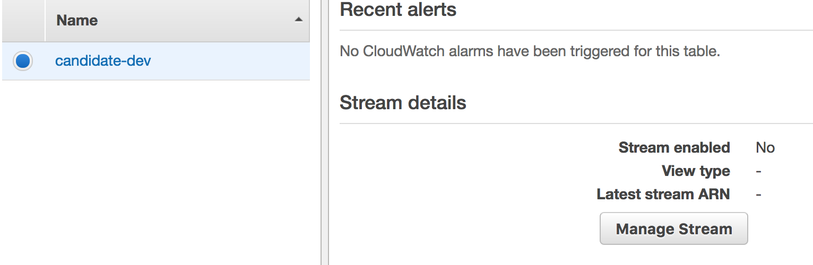

# Sending email notification with Amazon SES on DynamoDB Stream events

In this post, we will extend our application by adding functionality to send an email containing assignment to candidates. Workflow for today's use case is as following:

1. Recruitment team submits candidate details in the system. The candidate data will be saved in the DynamoDB. 
2. Our new lambda function will subscribe to DynamoDB stream. On each insert event, lambda function reads candidate details and based on candidate experience decide which assignment should be sent to the candidate. 
3. Finally, email is sent with attachment zip to the candidate.


## DynamoDB Streams

DynamoDB support streams that allows your application to get near real-time notifications of all the changes on your DynamoDB table. The event streams is a time-ordered sequence of all item-level changes made to any DynamoDB table. The event will be either INSERT, MODIFY, or REMOVE type. This feature enables writing event driven applications as you can subscribe to an event stream and based on the event type take an action. This works very nicely with Amazon Lambda. Your lambda functions are triggered when any data change happen in the table. In our use-case, we will send email to candidate with interview assignment attachment.

Let's build our today's usecase step by step.


## Step 1: Define `sendAssignment` function

Let's start by defining a functiomn in serverless.yml that listens to DynamoDB event stream.

```yaml
  sendAssignment:
    handler: api/candidates.sendAssignment
    memorySize: 128
    timeout: 30
    description: Send assignment zip to candidate
    events:
      - stream: "arn:aws:dynamodb:${self:provider.region}:${self:provider.environment.ACCOUNT_NUMBER}:table/${self:provider.environment.CANDIDATE_TABLE}/stream/${self:provider.environment.CANDIDATE_TABLE_STREAM_TIMESTAMP}"
```

In the YAML snippet shown above, we defined a function `sendAssignment` that is triggered when an event is published on a stream `arn:aws:dynamodb:<your-stream>`.  The handler function `sendAssignment` is again defined in the `api/candidates.js` file. Also, we have defined timeout for this function. The default timeout is 6 seconds and we have increated it to 30 seconds.

Please note you have to provide values for two environment variables `ACCOUNT_NUMBER` and `CANDIDATE_TABLE_STREAM_TIMESTAMP` . You will get their values in the next step.

```yaml
provider:
  name: aws
  runtime: nodejs4.3
  stage: dev
  region: us-east-1
  environment:
    CANDIDATE_TABLE: ${self:service}-${opt:stage, self:provider.stage}
    ACCOUNT_NUMBER: ""
    CANDIDATE_TABLE_STREAM_TIMESTAMP: ""
  iamRoleStatements:
    - Effect: Allow
      Action:
        - dynamodb:Query
        - dynamodb:Scan
        - dynamodb:GetItem
        - dynamodb:PutItem
        - ses:SendEmail
      Resource: "*"
```


## Step 2: Enable DynamoDB stream using the web console

Go to your table in DynamoDB web console and click on ***Manage Stream*** button to enable stream for `candidates-dev` table. Serverless does not provide support for enabling stream from the `serverless.yml` configuration.



Next, it will ask you to select view type. Please select ***New and old images*** and press ***Enable*** button.

Once stream is enabled,  you will see a stream ARN like `arn:aws:dynamodb:us-east-1:<account_id>:table/candidate-dev/stream/<stream_timestamp>` on the web console.

Copy the values of `account_id` and `stream_timestamp` and paste in the environment variable values we defined in step 1.

## Step 3: Create `sendAssigmment` function that prints event 

Now, that we have enabled stream and defined our function in serverless.yml. Let's write the function itself.  We will start by just printing the event to the console. Add the following to `api/candidates.js`.

```javascript
module.exports.sendAssignment = (event, context, callback) => {
  console.log('Received Event...', event);
  return callback(null, {
    statusCode: 200,
    body: 'Successfully receieved events'
  })
};
```

In the code shown above, we have only printed the event to the console. We then returned status code 200.

Deploy the function by executing `sls deploy` command. Once deployed test the function using cURL.

```Shell
$ curl -H "Content-Type: application/json" -X POST -d '{"fullname":"Shekhar Gulati", "email": "shekhargulati84@gmail.com",  "skills": "java", "experience": 12}' https://xxx.execute-api.us-east-1.amazonaws.com/dev/candidates
```

```Json
{
"message":"Sucessfully submitted candidate with email shekhargulati84@gmail.com",
"candidateId":"afa663c0-f8c2-11e6-aac9-f7b645b39ebc"
}
```

You can check the logs of your function from the serverless cli itself. 

```shell
$ serverless logs -f sendAssignment
```

```
START RequestId: 27ff6c08-3ee6-4003-81ad-3db16958ab33 Version: $LATEST
2017-02-21 17:44:52.489 (+05:30)	27ff6c08-3ee6-4003-81ad-3db16958ab33	Received Event... { Records:
   [ { eventID: 'f46f92dd4ba53e6e1912f5edeac68cf4',
       eventName: 'INSERT',
       eventVersion: '1.1',
       eventSource: 'aws:dynamodb',
       awsRegion: 'us-east-1',
       dynamodb: [Object],
       eventSourceARN: 'arn:aws:dynamodb:us-east-1:xxx:table/candidate-dev/stream/2017-02-21T12:05:33.650' } ] }
END RequestId: 27ff6c08-3ee6-4003-81ad-3db16958ab33
```

As you can see above, our event was printed in the logs. There are few things to note:

1. We receieve a batch of events.  AWS Lambda polls the stream and invokes your Lambda function synchronously when it detects new stream records.
2. Lambda function will have to filter only INSERT events and ignore rest events as we are not interested in them.

> ***Please note AWS lambda will be invoked for every change to your DynamoDB table. Currently. there is no way to configure that your lambda function should be invoked for only insert events.***

## Step 4: Adding bussiness logic to `sendAssigment` function

Now, we will write bussiness logic that will find the right assignment for the candidate. The code shown below just considers the experience but you can extend it to meet your own use case.

```javascript
module.exports.sendAssignment = (event, context, callback) => {
  console.log('Received Event...', event);
  const records = event.Records;
  const insertEvents = records.filter(r => r.eventName === "INSERT");
  console.log('filtered insert events ', insertEvents)

  let promises = [];
  for (let i = 0; i < insertEvents.length; i++) {
    const record = insertEvents[i];
    console.log('record', JSON.stringify(record));
    const experience = record.dynamodb.NewImage.experience.N;
    const candidateEmail = record.dynamodb.NewImage.email.S;
    console.log(`experience: ${experience}, candidateEmail: ${candidateEmail}`);
    const assignment = assigmentZipName(experience);
    console.log('Sending assignment', assignment);
    promises.push(sendEmail(candidateEmail, assignment));
  }
};

const assigmentZipName = (experience) => {
  if (experience > 0 && experience <= 5) {
    return "https://s3.amazonaws.com/my-bucket-name/assignment1.zip";
  } else if (experience > 5 && experience <= 8) {
    return "https://s3.amazonaws.com/my-bucket-name/assignment2.zip";
  } else {
    return "https://s3.amazonaws.com/my-bucket-name/assignment3.zip";
  }
}
```

In the code shown above:

1. We iterated over all the records and extracted out experience and `candidateEmail` from the record.
2. Then using the experience we decided which assignment we want to send to the candidate.
3. For each record, we also called a method `sendEmail`. `sendEmail` returned a promise that we pushed to the promises array.

## Step 5: Sending email using SES

The last step is implementing sendEmail function. For this we will use AWS SES API. First create ses variable at the top.

```javascript
const ses = new AWS.SES();
```

Then, create sendEmail function as shown below.

```javascript
const sendEmail = (candidateEmail, assignment) => {
  var params = {
    Destination: {
      ToAddresses: [
        candidateEmail,
      ]
    },
    Message: {
      Body: {
        Text: {
          Data: 'Hello, please download assignment from ' + assignment,
        }
      },
      Subject: {
        Data: 'Coding Round'
      }
    },
    Source: '<source_email>',
    ReplyToAddresses: [
      '<reply_to_email>',
    ],
  };
  ses.sendEmail(params).promise();
}
```

Lastly, we have to update `sendAssignment` function to handle the promises.

```javascript
module.exports.sendAssignment = (event, context, callback) => {
  console.log('Received Event...', event);
  const records = event.Records;
  const insertEvents = records.filter(r => r.eventName === "INSERT");
  console.log('filtered insert events ', insertEvents)

  let promises = [];
  for (let i = 0; i < insertEvents.length; i++) {
    const record = insertEvents[i];
    console.log('record', JSON.stringify(record));
    const experience = record.dynamodb.NewImage.experience.N;
    const candidateEmail = record.dynamodb.NewImage.email.S;
    console.log(`experience: ${experience}, candidateEmail: ${candidateEmail}`);
    const assignment = assigmentZipName(experience);
    console.log('Sending assignment', assignment);
    promises.push(sendEmail(candidateEmail, assignment));
  }

  Promise.all(promises)
    .then(res => callback(null, `Successfully sent email to candidates.`))
    .catch(err => {
      console.log('Encountered error while sending email ', err);
      callback(err);
    });
};
```

## Conclusion

In today's post, you learnt how you can send notification via email when a database record is inserted in the DynamoDB. One thing that you should realize is that building serverless applications is all about integrating with different provider services. Using provider services is a two edge sword — one one side you don't have to worry about running and managing service but on the other side you have to live within the constraints of the provider. In the [next post](./07-uploading-assignment-to-s3-using-presigned-urls.md), we will learn how to upload assignment to S3 using pre-signed S3 URLs.
